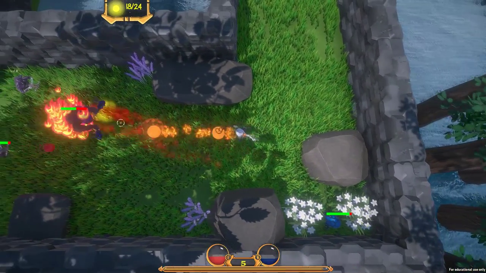

# Orbment Major Project Assessment

This was the final assessment for my second year at AIE. We were assigned a group and given 16 weeks to create a game. I was one of the two programmers in the group. I was responsible for programming the player input (keyboard, mouse & Xbox controller), menus, HUD, player controller, enemy AI, music, serialization, optimisation & more.

Orbment is a fast-paced top-down roguelike game where you must use your quick reflexes and powerups to defeat enemies in each level.

You can download the Windows build following the link below.

https://strongishllama.itch.io/orbment
